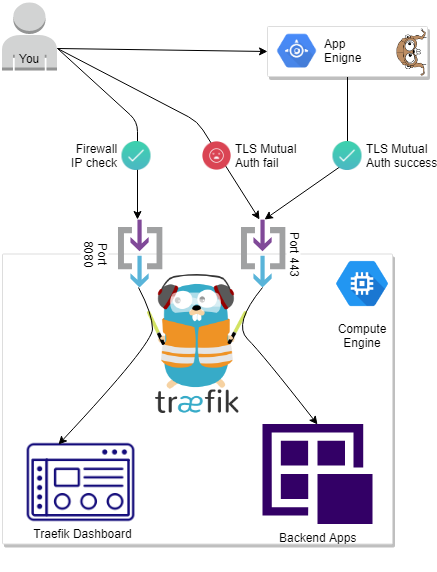

# gae-workshop

This workshop guides you thourgh process of creation simple and completely free backend on Google Cloud Platform, utilizing only [always free](https://cloud.google.com/free/) resources and configuration of [TLS Mutual Authentication](https://medium.com/sitewards/the-magic-of-tls-x509-and-mutual-authentication-explained-b2162dec4401) betweeen Google App Engine application and Google Compute Engine server.

Diagram HERE

## Prerequisites

Better to follow the workshop steps in the [Google Cloud Shell](https://console.cloud.google.com/appengine?cloudshell=true&_ga=2.219504537.-1092609672.1545216569), since it will give you already configured environment with most of the tools you need.

In order to access [Google Cloud Shell](https://console.cloud.google.com/appengine?cloudshell=true&_ga=2.219504537.-1092609672.1545216569), you will be prompted to create a new project (if you don't have any), do so, and then you can skip *Creating a GCP project* in the [Level 0](https://cloud.google.com/appengine/docs/standard/go111/building-app/).

If you already have some GCP project, better to create new one for this workshop, so you can safely remove it afterwards

## [Level 0](https://cloud.google.com/appengine/docs/standard/go111/building-app/)

There are two types of App Engine environments:
- Standart
- Flexible

We will be using **App Engine Standart Environment**. More information about environment types [here](https://cloud.google.com/appengine/docs/the-appengine-environments). 

Go through official guide [Building a Go App on App Engine](https://cloud.google.com/appengine/docs/standard/go111/building-app/)!

**Note**: Using `us-central` region.
Also, you need to enable Google Cloud APIs to be able to run deploy via 
`gcloud app deploy` command :

- Google Cloud Build API `gcloud services enable cloudbuild.googleapis.com`
- Google Compute Engine API `gcloud services enable compute.googleapis.com`

## [Level 1](./level1/README.md)

Deploy and provision simple webserver with terraform, then access it from GAE app.

## [Level 2](./level2/README.md)

Protect connection between app and server with [TLS Mutual Authentication](https://medium.com/sitewards/the-magic-of-tls-x509-and-mutual-authentication-explained-b2162dec4401).
